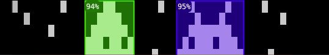

# Invader Detector



## Walkthrough

If you're using this program, sadly you know we have no time to waste.

```sh
cd /path/to/invader-detector

./detect-invaders.sh \
  --radar-sample-file resources/spec-radar-sample-2-guys.txt \
  --invader-files resources/spec-invader-1.txt:resources/spec-invader-2.txt \
  --print-ascii

---╭84%─────╮------o-╭91%────────╮-
-oo│---oo---│-o--o-o-│--o-----o--│-
-o-│--oooo--│---oo---│-------o---│-
---│oooooooo│--o-----│--oooo-oo--│-
---│oo-oo--o│-o--o---│----ooo-oo-│-
o--│-ooooooo│--------│o--oooooo-o│-
o--│--o--ooo│--o----o│o-o-ooooo-o│-
---│-o-oo---│-----o-o│o-o-----o-o│-
---│oo--oo-o│-----o--│---oo-oo---│-
---╰────────╯------o-╰───────────╯-
---o----o------o-----╰────────╯──╯-
```

Let's clarify that image with
`--output-ascii-on-char "█"` and
`--output-ascii-off-char " "`:

```sh
./detect-invaders.sh \
  --radar-sample-file resources/spec-radar-sample-2-guys.txt \
  --invader-files resources/spec-invader-1.txt:resources/spec-invader-2.txt \
  --print-ascii \
  --output-ascii-on-char "█" --output-ascii-off-char " "

   ╭84%─────╮      █ ╭91%────────╮ 
 ██│   ██   │ █  █ █ │  █     █  │ 
 █ │  ████  │   ██   │       █   │ 
   │████████│  █     │  ████ ██  │ 
   │██ ██  █│ █  █   │    ███ ██ │ 
█  │ ███████│        │█  ██████ █│ 
█  │  █  ███│  █    █│█ █ █████ █│ 
   │ █ ██   │     █ █│█ █     █ █│ 
   │██  ██ █│     █  │   ██ ██   │ 
   ╰────────╯      █ ╰───────────╯ 
   █    █      █     ╰────────╯──╯ 
```

If you prefer images, try `--save-images two-invaders.png`:

```sh
./detect-invaders.sh \
  --radar-sample-file resources/spec-radar-sample-2-guys.txt \
  --invader-files resources/spec-invader-1.txt:resources/spec-invader-2.txt \
  --save-images two-invaders.png
```


Shell-shocked veterans who've seen too many invaders appreciate `--output-ascii-opaque-fill`:

```sh
./detect-invaders.sh \
  --radar-sample-file resources/spec-radar-sample-2-guys.txt \
  --invader-files resources/spec-invader-1.txt:resources/spec-invader-2.txt \
  --print-ascii \
  --output-ascii-on-char "█" \
  --output-ascii-off-char " " \
  --output-ascii-opaque-fill

   ╭84%─────╮      █ ╭91%────────╮ 
 ██│        │ █  █ █ │           │ 
 █ │        │   ██   │           │ 
   │        │  █     │           │ 
   │        │ █  █   │           │ 
█  │        │        │           │ 
█  │        │  █    █│           │ 
   │        │     █ █│           │ 
   │        │     █  │           │ 
   ╰────────╯      █ ╰───────────╯ 
   █    █      █     ╰────────╯──╯ 
```

The default match score is 70%. The radar gets crowded with
`--score-threshold 60`:

```sh
./detect-invaders.sh \
  --radar-sample-file resources/spec-radar-sample-2-guys.txt \
  --invader-files resources/spec-invader-1.txt:resources/spec-invader-2.txt \
  --print-ascii \
  --output-ascii-on-char "█" \
  --output-ascii-off-char " " \
  --output-ascii-opaque-fill \
  --score-threshold 60

│6╭╭84%─────╮─╮─╮╮ █ ╭91%────────╮─
│ ││        │ │ ││ █ │           │ 
│ ││        │ │ ││   │           │ 
│ ││        │ │ ││   │           │ 
│ ││        │ │ ││   │           │ 
│ ││        │ │ ││   │           │ 
│ ││        │ │ ││  █│           │ 
│ ││        │ │ ││█ █│           │ 
╰─││        │ │ ││█  │           │ 
  ╰╰────────╯─╯─╯╯ █ ╰───────────╯─
  ╰────────╯─╯ █     ╰────────╯──╯─
```

So far, we've focused on human UIs. But naturally we'll need more
precise data:

```sh
./detect-invaders.sh \
  --radar-sample-file resources/spec-radar-sample.txt \
  --invader-files resources/spec-invader-1.txt:resources/spec-invader-2.txt \
  --print-matches

({:invader-id 0,
  :bbox {:x 60, :y 13, :width 11, :height 8},
  :score 90.9090909090909}
 {:invader-id 1,
  :bbox {:x 42, :y 0, :width 8, :height 8},
  :score 87.5}
 {:invader-id 0,
  :bbox {:x 74, :y 1, :width 11, :height 8},
  :score 87.5}
 {:invader-id 0,
  :bbox {:x 85, :y 12, :width 11, :height 8},
  :score 86.36363636363636}
 {:invader-id 1,
  :bbox {:x 82, :y 41, :width 8, :height 8},
  :score 85.9375}
 {:invader-id 1,
  :bbox {:x 16, :y 28, :width 8, :height 8},
  :score 85.9375}
 ...
```

Let's try a bigger radar sample.

(Incidentally, setting `--score-threshold` to a higher threshold
results in fewer matches.  It's `70` by default.)

```
./detect-invaders.sh \
  --radar-sample-file resources/spec-radar-sample.txt \
  --invader-files resources/spec-invader-1.txt:resources/spec-invader-2.txt \
  --save-images spec-locations-threshold-70.png
```


## Usage

There's quite a few options. Also, you can use multiple output
switches together in a single commandline.

```sh
./detect-invaders.sh --help
Detect invaders in radar samples.

Usage: ./invader-detector.sh [options]

Options:
      --radar-sample-file FILE                       Radar sample file
      --invader-files FILES                          Invader files separated by colons
      --input-on-chars CHARS        o,O              Characters denoting 'on', separated by commas
      --input-off-chars CHARS       -                Characters denoting 'off', separated by commas
      --input-lenient-parsing       true             Be lenient when interpreting input files.

      --max-results COUNT                            Maximum number of matches
      --score-threshold PERCENT     70               Minimum match score to include in results. Number from 0 to 100

      --print-ascii                                  Print ascii to screen
      --save-ascii FILE                              Output text file
      --save-images FILES                            Output image files, separated by colons.
      --print-matches                                Print matches to screen
      --save-matches FILE                            File with EDN-encoded matches
      --invader-colors COLORS       #4300ff,#44f20d  Colors to highlight invaders. Recycled if fewer colors than invaders.
      --output-ascii-on-char CHAR   o                For ascii output, character denoting 'on'.
      --output-ascii-off-char CHAR  -                For ascii output, character denoting 'off'.
      --output-ascii-opaque-fill                     For ascii output, make bounding boxes blank inside.
  -h, --help
```

## Design

### Where to start?

One place is
[user.clj](https://github.com/tjg/invader-detector/blob/c6126b53561284ec4b5a710cebd25e32f60cfda1/dev/src/user.clj#L34),
a developer sandbox that's likely convenient than the CLI. Simply
evaluating the whole buffer will print results in the REPL, as well as
save images & matches to a temp dir.

It calls
[run.clj](https://github.com/tjg/invader-detector/blob/c6126b53561284ec4b5a710cebd25e32f60cfda1/src/industries/tjg/invader_detector/run.clj#L154),
which coordinates this app's sources/processors/sinks pipeline:


`pixel-matrix`: 2D vector representing a radar sample or pattern.

```clojure
[[0 0 0 1 1 0 0 0]
 [0 0 1 1 1 1 0 0]
 [0 1 1 1 1 1 1 0]
 [1 1 0 1 1 0 1 1]
 [1 1 1 1 1 1 1 1]
 [0 0 1 0 0 1 0 0]
 [0 1 0 1 1 0 1 0]
 [1 0 1 0 0 1 0 1]]
```

`scorebox`: map representing a bounding box in the radar sample,
with a score that estimates the likelihood that an invader's in the
bounding box.

```clojure
{:score 5/8
 :bbox {:x -1, :y -1, :width 6, :height 8}}
```

### Testing

`clj -X:test` runs tests.

Two testing frameworks:
- Rich Comment Tests: a kind of literate programming that helps
  explain the code.
- Expectations unit tests: more expressive than `clojure.test`, but
  compatible with its tooling.

### Performance

> *“The real problem is that programmers have spent far too much time
> worrying about efficiency in the wrong places and at the wrong
> times; premature optimization is the root of all evil (or at least
> most of it) in programming.”*
>
> — Donald Knuth, "The Art of Computer Programming"

This currently uses a O(N²) algorithm. If performance optimization's
needed, [Criterium](https://github.com/hugoduncan/criterium) (a handy
benchmarking library) is included in the `:deps` alias.

There's many optimization opportunities: CPU cache-friendly
datastructures, bit-vector comparisons, pre-processing, and judicious
parallelism.

## License

Copyright © 2025 Tayssir John Gabbour
